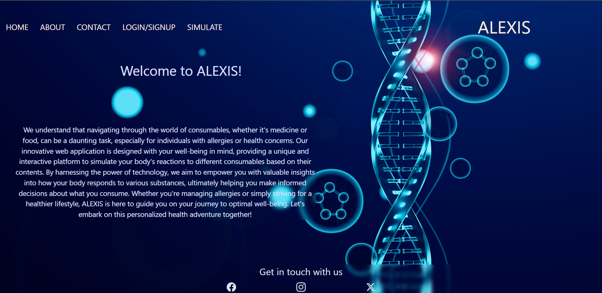
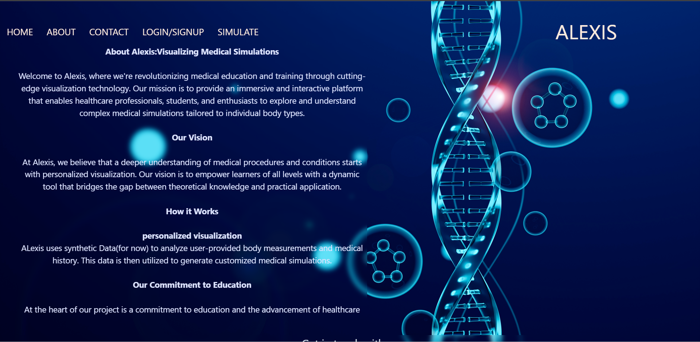
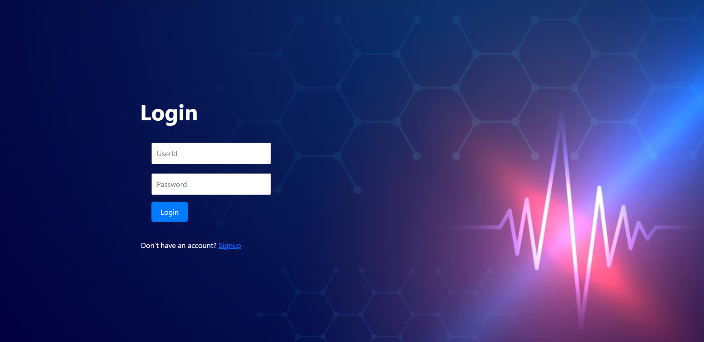
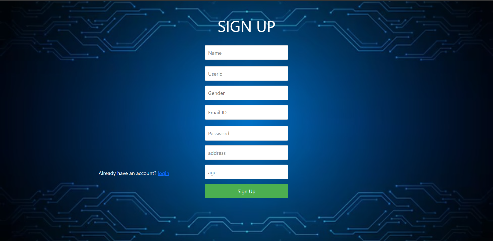
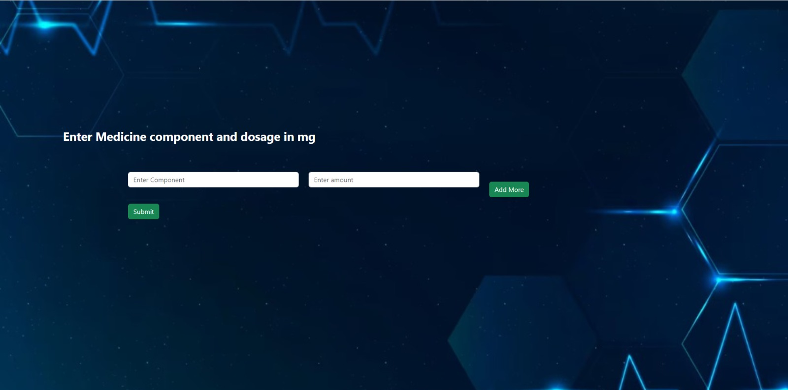

# Alexis: Visualizing Medical Simulations
Alexis is a web project that focuses on visualizing medical simulations tailored to individual user body types. This platform is designed to ease medical education and training by providing an immersive and interactive learning experience.
## Table of Contents
- [Problem Statement](#problem-statement)
- [Features](#features)
- [Installation](#installation)
- [Usage](#usage)
- [Design Decisions](#design-decisions)
- [Technologies Used](#technologies-used)
- [Contributing](#contributing)
- [GitHub Repository](#github-repository)
- [Contact](#contact)
- [Team](#team)
- [License](#license)
## Problem Statement
People usually are unaware of what medications affect which part of the body and how multiple medications can also affect the human body.
Alexis' goal is to make users aware of what happens to user when they take particular types of medications based on the data present.
## Features
+ User authentication
+ Taking input of medications and user-specific data from users
## Installation
To set up and run Alexis locally:
1. Clone the repository.
2. Goto to Alexis/Frontend directory and run `npm install`
3. Goto to Alexis/Backend directory and run `npm install`
4. Goto to the Frontend directory and run `npm start`
5. Goto to the Backend directory and run `node index.js`
6. Access the app in your web browser at `http://localhost:3000`.
## Usage
When the user runs the web app, the home page loads first. Users can navigate to About, Contact, Login/Signup, and Simulate Pages using the navigation bar. There is also a footer to view the web's social accounts(social media accounts in future updates). 
`Home Page`:

`About Page` describes the `Alexis` Web project.

`Login Page` 

`Signup Page` 

User input for simulation

## Design Decisions
+ Using Synthetic Data - As of now, there are APIs that can tell the side effects of medicine for typical humans, but not user-specific data. So, we choose to use synthetic data to provide user-specific output. The web app tries to provide infrastructure for when such data is available.
+ Using Axios library to communicate with the backend - Axios is used to communicate with the backend, and it also supports the Promise API that is native to JS ES6.What are the advantages of using Axios?
Axios is a popular third-party library that simplifies the process of making HTTP requests in JavaScript. It provides an easy-to-use API with built-in features for handling request and response interceptors, data transformation, and error handling.
## Technologies Used
- React, HTML, CSS for frontend
- Node, Axios for backend
- MongoDB for user authentication and authorization
## Contributing
We welcome contributions from the community! If you'd like to contribute, please follow these steps:
1. Fork the repository.
2. Create a new branch for your feature or bug fix.
3. Make your changes and commit them.
4. Push your branch to your fork.
5. Submit a pull request with a detailed description of your changes.
## GitHub Repository
Github link [https://github.com/CS21B008/Alexis](https://github.com/CS21B008/Alexis)
## Contact
For inquiries or feedback, please contact us at cs21b008@iittp.ac.in or cs21b054@iittp.ac.in
## Team
+ **Team Name:** Team 13
+ **Team Members and Contributions:**
  - *A. Shree Balaji* - Frontend(Home, About, Contact, Header and Footer pages)
  - *V. Charvy* - Frontend(Login and Signup pages) and MongoDB connection
## License
This project is licensed under the MIT License.
